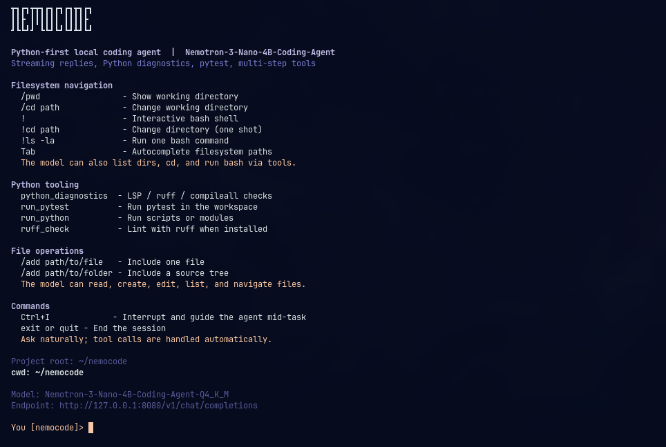
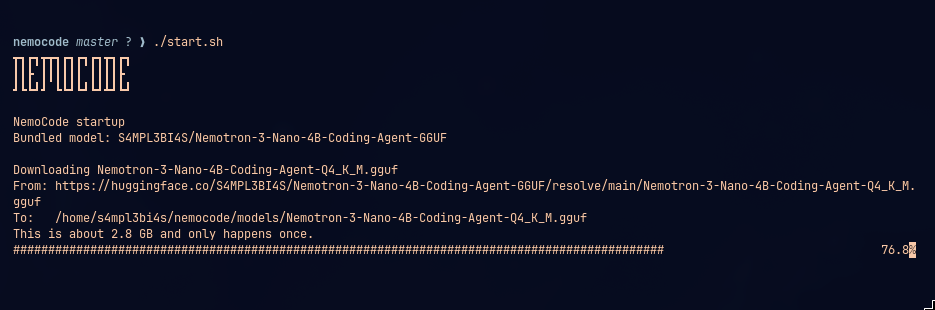
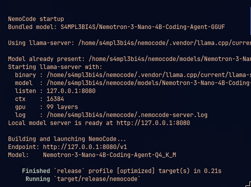

# NemoCode

Fast, lightweight local coding agent.

NemoCode is a Rust CLI harness with streaming chat, multi-step tool use, bash/filesystem
navigation, and Tab path autocomplete. Out of the box it uses one model only:

[S4MPL3BI4S/Nemotron-3-Nano-4B-Coding-Agent-GGUF](https://huggingface.co/S4MPL3BI4S/Nemotron-3-Nano-4B-Coding-Agent-GGUF)

```
┳┓┏┓┳┳┓┏┓┏┓┏┓┳┓┏┓
┃┃┣ ┃┃┃┃┃┃ ┃┃┃┃┣ 
┛┗┗┛┛ ┗┗┛┗┛┗┛┻┛┗┛
```



## What it does

- Local-only inference through an OpenAI-compatible `llama-server`
- Streaming replies with a TTFB spinner until the first token
- Multi-step tool loop for files, directories, and bash
- Vybrid-style filesystem navigation (`/cd`, `/pwd`, `!`, `!cd`, `!command`)
- Tab autocomplete for filesystem paths
- Must launch from the nemocode project directory

No cloud API keys. No alternate model providers. The bundled GGUF is the model.

## Requirements

- Rust toolchain (`cargo`)
- `curl` and `tar`
- About 3 GB disk for the Q4_K_M GGUF, plus RAM/VRAM for inference

`llama-server` is installed automatically on first launch from the official
[llama.cpp](https://github.com/ggml-org/llama.cpp) GitHub releases into
`.vendor/llama.cpp/`. If `llama-server` is already on your `PATH`, that binary
is used instead.

Optional download helpers: `hf`, `huggingface-cli`, or `wget`.

## Quick start

```bash
git clone https://github.com/SampleBias/nemocode.git
cd nemocode
chmod +x start-nemo.sh
./start-nemo.sh
```

The startup script will:

1. Print the NemoCode banner
2. Verify it is running from the nemocode project root
3. Install `llama-server` automatically if it is not already available
4. Download `Nemotron-3-Nano-4B-Coding-Agent-Q4_K_M.gguf` into `models/` if missing
5. Start `llama-server` with `--jinja` (required for tool calling)
6. Build and launch the NemoCode CLI against `http://127.0.0.1:8080/v1`





## Launch rule

NemoCode must be started from the nemocode project directory (the folder that
contains `Cargo.toml` named `nemocode` and `start-nemo.sh`).

- `./start-nemo.sh` always `cd`s to that directory first
- `cargo run` from another directory is rejected

## Usage

```text
You [nemocode]> /pwd
You [nemocode]> /cd te<Tab>
You [nemocode]> /cd test/
You [test]> !ls -la
You [test]> !
shell test> cd ..
shell nemocode> exit
You [nemocode]> /add src/main.rs
You [nemocode]> Explain the tool loop and suggest a small cleanup
You [nemocode]> exit
```

### Commands

| Input | Effect |
| --- | --- |
| `/pwd` | Show the current working directory |
| `/cd path` | Change the process working directory |
| `!` | Enter interactive bash shell mode |
| `!cd path` | Change directory without entering shell mode |
| `!command` | Run one bash command in the current directory |
| `Tab` | Autocomplete filesystem paths |
| `/add path/to/file` | Add one file to conversation context |
| `/add path/to/folder` | Add a source tree (skips junk/binary/large files) |
| `exit` or `quit` | End the session |

### Tab autocomplete

Press `Tab` to complete paths:

- `/cd te` → `test/` (directories preferred for `/cd` and `!cd`)
- `/add sr` → files and folders under the current path
- `!cd`, `!ls`, and other `!` commands also complete path arguments
- Inside `!` shell mode, Tab completes filesystem paths anywhere on the line

### Filesystem navigation

Relative file-tool paths resolve against the live working directory. A
`SESSION LOCATION` block (cwd + project root) is injected when the working
directory changes, not on every turn.

The model can navigate too, via tools:

- `list_directory`
- `change_directory`
- `execute_bash_command`

Plus file tools:

- `read_file` / `read_multiple_files`
- `create_file` / `create_multiple_files`
- `edit_file`

## Performance

NemoCode includes several local-inference speedups:

| Feature | What it does |
| --- | --- |
| Default `max_tokens` 4096 | Smaller completion budget for faster tool turns |
| Sticky history budget | Keeps a stable prompt prefix; default ~12k tokens (`NEMO_CONTEXT_BUDGET`) |
| Tool-result compaction | Middle-truncates large tool outputs (12KB file/list, 48KB other) |
| TTFB spinner | Shows activity until the first streamed chunk |
| Tool-call stream feedback | Single-line args spinner (name × count · size) while tool JSON streams |
| Tool-call stream guards | Early-stops runaway tool streams (>8 calls or >24KB args) and dedupes |
| SSE idle timeout | Fails loudly if the model stops sending chunks (`NEMO_SSE_IDLE_TIMEOUT_SECS`) |
| Bash / parallel progress | Elapsed spinner for bash; spinner + done line for parallel reads |
| SESSION LOCATION on cwd change | Avoids repeating location text every turn |
| Parallel read-only tools | Runs multiple reads/lists in one round concurrently |
| Identical-loop nudge | After 3 identical read-only calls in a turn, nudges the model not to repeat |
| File-read cache | Caches by path + mtime + size; cleared on edit / `cd` / bash |

## Configuration

Copy `.env.example` to `.env` if you want persistent overrides.

| Variable | Default | Meaning |
| --- | --- | --- |
| `NEMO_BASE_URL` | `http://127.0.0.1:8080/v1` | Local OpenAI-compatible base URL |
| `NEMO_MODEL` | `Nemotron-3-Nano-4B-Coding-Agent-Q4_K_M` | Model id sent to the server |
| `NEMO_API_KEY` | `local` | Optional; unused unless the server enforces auth |
| `NEMO_MAX_TOKENS` | `4096` | Max completion tokens |
| `NEMO_TOOL_ROUNDS` | `8` | Max tool-call rounds per user turn |
| `NEMO_CONTEXT_BUDGET` | `12000` | Approx prompt-token budget for sticky history compaction |
| `NEMO_SSE_IDLE_TIMEOUT_SECS` | `90` | Abort if the SSE stream stalls with no chunks |

Launcher overrides for `./start-nemo.sh`:

| Variable | Default | Meaning |
| --- | --- | --- |
| `NEMO_MODEL_PATH` | `models/Nemotron-3-Nano-4B-Coding-Agent-Q4_K_M.gguf` | Local GGUF path |
| `NEMO_HOST` / `NEMO_PORT` | `127.0.0.1` / `8080` | Server bind address |
| `NEMO_CTX` | `16384` | Context size |
| `NEMO_GPU_LAYERS` | `99` | GPU offload layers (`0` for CPU) |
| `NEMO_THREADS` | unset | Optional CPU thread count |
| `NEMO_PARALLEL` | `1` | Server slots (1 = full context for single-agent use) |
| `NEMO_FLASH_ATTN` | `on` | Flash Attention (`on` / `off` / `auto`) |
| `NEMO_BATCH` | `2048` | Logical batch size for prefill |
| `NEMO_UBATCH` | `512` | Physical micro-batch size |
| `NEMO_CACHE_TYPE_K` / `NEMO_CACHE_TYPE_V` | `q8_0` | KV cache element types |
| `NEMO_MLOCK` | unset | Set `1` to pin the model in RAM (`--mlock`) |
| `NEMO_LLAMA_SERVER` | auto-detect / auto-install | Path to `llama-server` |
| `NEMO_LLAMA_BACKEND` | auto | Force `cpu`, `vulkan`, or `rocm` for auto-install |
| `NEMO_LLAMA_RELEASE` | latest | Pin a llama.cpp release tag (for example `b10043`) |
| `NEMO_VENDOR_DIR` | `.vendor/llama.cpp` | Where auto-installed binaries are stored |

Example CPU-only launch:

```bash
NEMO_GPU_LAYERS=0 NEMO_CTX=8192 ./start-nemo.sh
```

## Manual run

If the server is already running from the nemocode directory:

```bash
export NEMO_BASE_URL=http://127.0.0.1:8080/v1
export NEMO_MODEL=Nemotron-3-Nano-4B-Coding-Agent-Q4_K_M
cargo run --release
```

Example `llama-server` command:

```bash
llama-server \
  --model models/Nemotron-3-Nano-4B-Coding-Agent-Q4_K_M.gguf \
  --host 127.0.0.1 \
  --port 8080 \
  --ctx-size 16384 \
  --n-gpu-layers 99 \
  --parallel 1 \
  --flash-attn on \
  --batch-size 2048 \
  --ubatch-size 512 \
  --cache-type-k q8_0 \
  --cache-type-v q8_0 \
  --jinja
```

## Model

- Repo: [S4MPL3BI4S/Nemotron-3-Nano-4B-Coding-Agent-GGUF](https://huggingface.co/S4MPL3BI4S/Nemotron-3-Nano-4B-Coding-Agent-GGUF)
- File: `Nemotron-3-Nano-4B-Coding-Agent-Q4_K_M.gguf`
- Quant: Q4_K_M (~2.8 GB)
- Base: Unsloth / NVIDIA Nemotron 3 Nano 4B
- Fine-tune focus: coding and pythonic function calling

Model weights are governed by the
[NVIDIA Nemotron Open Model License](https://www.nvidia.com/en-us/agreements/enterprise-software/nvidia-nemotron-open-model-license/).
The NemoCode harness itself is MIT-licensed.

## Project layout

```text
nemocode/
  Cargo.toml
  LICENSE
  README.md
  start-nemo.sh
  .env.example
  src/main.rs
  docs/assets/          # README screenshots
  models/               # downloaded GGUF (gitignored)
  .vendor/llama.cpp/    # auto-installed llama-server (gitignored)
```

## License

MIT. See [LICENSE](LICENSE).
